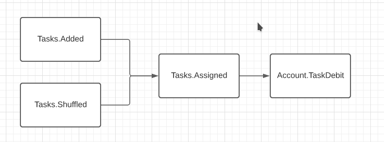
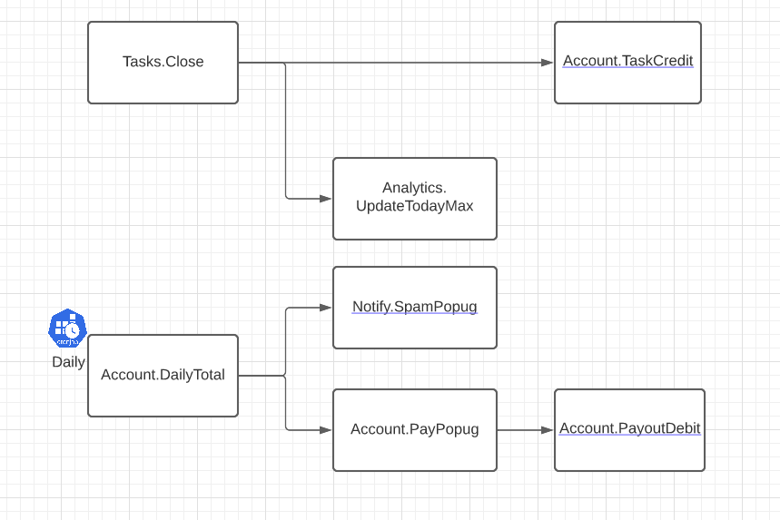
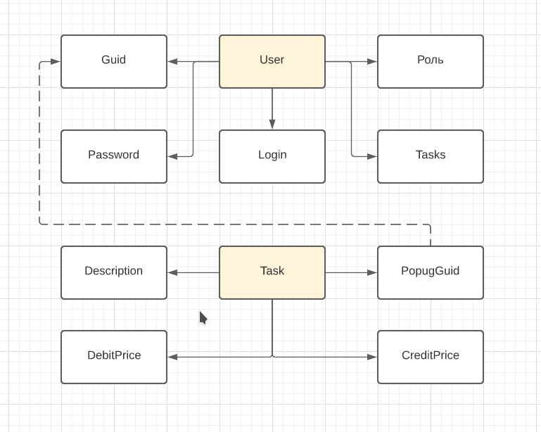
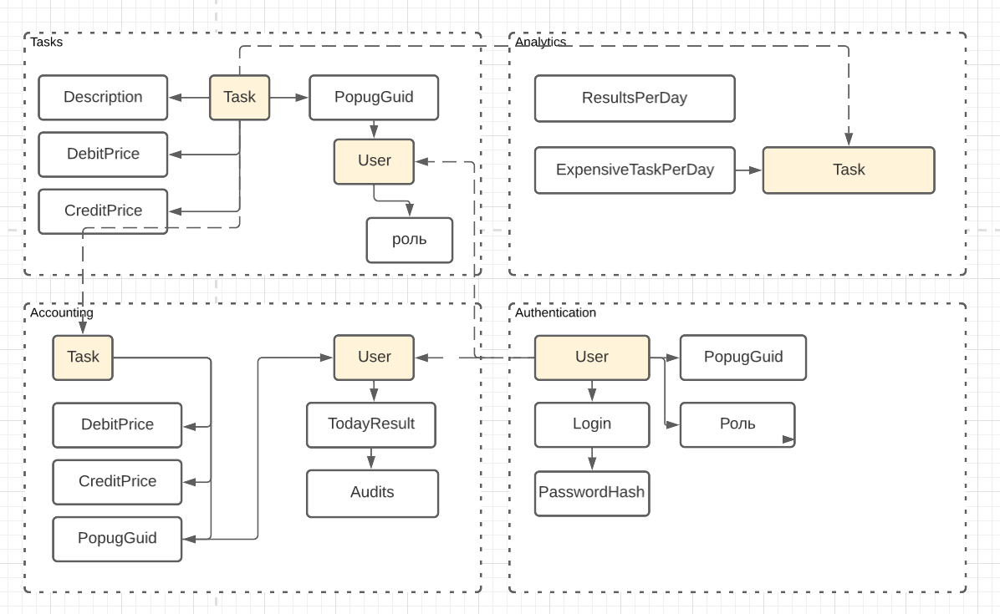
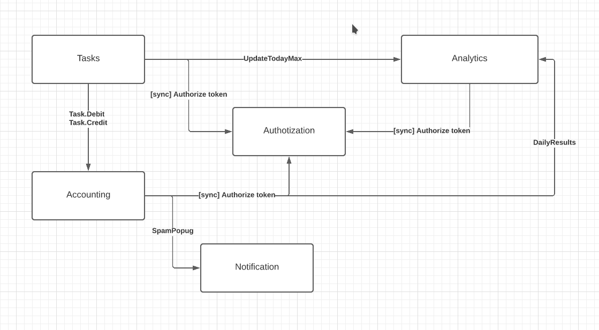

## События

1.  Авторизация в таск-трекере должна выполняться через общий сервис авторизации UberPopug Inc (у нас там инновационная система авторизации на основе формы клюва).
    
    1.  **Actor** \- User
    2.  **Command** \- Get token
    3.  **Data** \- Login, Password
    4.  **Event** \- Auth.TokenReceived
2.  *Таск-трекер должен быть отдельным дашбордом и доступен всем сотрудникам компании UberPopug Inc.*
    
    1.  **Actor** \- User
    2.  **Query** \- Get tasks
    3.  **Data** \- Token
    4.  **Event** \- Tasks.Index
3.  *Новые таски может создавать кто угодно (администратор, начальник, разработчик, менеджер и любая другая роль). У задачи должны быть описание, статус (выполнена или нет) и попуг, на которого заассайнена задача.*
    
    1.  **Actor** \- User | Manager | Admin
    2.  **Command** \- Add task
    3.  **Data** \- Token, Description, Status, PopugGuid
    4.  **Event** \- Tasks.Added
        1.  1.  =\> produces Tasks.Assigned
4.  *Менеджеры или администраторы должны иметь кнопку «заассайнить задачи», которая возьмёт все открытые задачи и рандомно заассайнит каждую на любого из сотрудников (кроме менеджера и администратора) . Не успел закрыть задачу до реассайна — сорян, делай следующую.*
    
    1.  **Actor** \- Manager | Admin
    2.  **Command** \- Shuffle
    3.  **Data** \- Token
    4.  **Event** \- Tasks.Shuffled
        1.  =\> fanouts Tasks.Assigned
            4*. Событие назаначения задачи
    5.  **Actor** \- Tasks.Shuffled | Tasks.Added
    6.  **Command** \- Assign task to popug
    7.  **Data** \- PopugGuid, TaskId
    8.  **Event** \- Tasks.Assigned
5.  *Каждый сотрудник должен иметь возможность видеть в отдельном месте список заассайненных на него задач \+ отметить задачу выполненной.*
    
    1.  **Actor** \- User
    2.  **Command** \- Change Status
    3.  **Data** \- Token, TaskId, Status
    4.  **Event** \- Tasks.Close
6.  Аккаунтинг должен быть в отдельном дашборде и доступным только для администраторов и бухгалтеров.
    
    1.  1.  **Actor** \- Admin | Accounting
            
        2.  **Query** \- Get accounts
            
        3.  **Data** \- Token
            
        4.  **Event** \- Account.Index
            
        5.  **Actor** \- Admin | Accounting
            
        6.  **Query** \- Get audit
            
        7.  **Data** \- Token
            
        8.  **Event** \- Account.Audits
            
7.  У обычных попугов доступ к аккаунтингу тоже должен быть.
    
    1.  1.  **Actor** \- User
        2.  **Query** \- Get my account with audits
        3.  **Data** \- Token
        4.  **Event** \- Account.Show
8.  формула, которая говорит сколько списать денег с сотрудника при ассайне задачи — rand(-10..-20)$
    
    1.  **Actor** \- Tasks.Assigned
    2.  **Comand** \- Debit account
    3.  **Data** \- Token, PopugGuid, TaskId
    4.  **Event** \- Account.TaskDebit
9.  формула, которая говорит сколько списать денег с сотрудника при ассайне задачи — rand(-10..-20)$
    
    1.  **Actor** \- Tasks.Close
    2.  **Comand** \- Credit account
    3.  **Data** \- Token, PopugGuid, TaskId
    4.  **Event** \- Account.TaskCredit
10. Дешборд должен выводить количество заработанных топ-менеджментом за сегодня денег.
    1\. **Actor** \- Manager
    2\. **Query** \- Get my financial result
    3\. **Data** \- Token
    4\. **Event** \- Account.Earnings
    
11. Ежедневная статистика
    
    1.  **Actor** \- End of day
    2.  **Command** \- Aggregate popug results
    3.  **Data** \- Date
    4.  **Event** \- Account.DailyTotal
12. Рассылка итогов дня
    
    1.  **Actor** \- Account.DailyTotal
    2.  **Command** \- Send daily total
    3.  **Data** \- PopugId, Sum
    4.  **Event** \- Notify.SpamPopug
13. Выплата
    
    1.  **Actor** \- Account.DailyTotal
    2.  **Command** \- Payout
    3.  **Data** \- PopugId, Sum
    4.  **Event** \- Account.PayPopug
14. Обнуление баланса
    
    1.  **Actor** \- Account.PayPopug
    2.  **Command** \- Debit popug payout
    3.  **Data** \- PopugId, Sum
    4.  **Event** \- Account.PayoutDebit
15. Аналитика
    
    1.  1.  **Actor** \- Manager
            
        2.  **Query** \- Today totals and popug neg stats
            
        3.  **Data** \- Token
            
        4.  **Event** \- Analytics.TodayTotals
            
        5.  **Actor** \- Manager
            
        6.  **Query** \- Most expensive task
            
        7.  **Data** \- Token, Day
            
        8.  **Event** \- Analytics.MostExpensive
            
16. Подсчет самой дорогой таски
    
    1.  **Actor** \- Tasks.Close
    2.  **Command** \- Update most expensive task
    3.  **Data** \- Sum
    4.  **Event** \- Analytics.UpdateTodayMax

## Цепочки событий

## Модель данных

## Домены

1.  Tasks
2.  Accounting
3.  Analytics
4.  Authentication
    

Сущность задачи разделяется между доменами Tasks, Accounting, Analytics. Первоначально создается в домене Tasks событием Tasks.Added, обновляется по Tasks.Assigned. По этим обытитиям требуется выполнять перенос сущности в домен Accounting. Также данные задачи переносятся в домен аналитики в эвенте Analytics.UpdateTodayMax, для того чтобы отображать информацию о самой дорогой таске за день.

Сущность User разделяется между Authentication, Accounting и Tasks. Информация переносится в другие домены при создании и обновлении в домене аутентификации.

## Сервисы

## Бизнес-события

| Описание события | Название | Publisher | Consumer | (a)sync |
| --- | --- | --- | --- | --- |
| Get token | Auth.TokenReceived | User | Authentication | Sync |
| Get tasks | Tasks.Index | User | Tasks | Sync |
| Add task | Tasks.Added | User | Tasks | Sync |
| Shuffle | Tasks.Shuffled | User | Tasks | Sync |
| Tasks assigned | Tasks.Assigned | Tasks | Account.TaskCredit | Async |
| Update today max | Analytics.UpdateTodayMax | Tasks | Analytics | Async |
| Aggregate popug results | CRON | Accounting | Analytics | Async |
| Close task | Tasks.Close | User | Tasks | Sync |
| Credit for closed tasks | Account.TaskCredit | Tasks | Account.TaskCredit | Async |
| Debit for assigned tasks | Account.TaskDebit | Tasks | Account.TaskCredit | Async |
| Notify and pay to popug chain | Notify.SpamPopug, Account.PayPopug, Account.DebitPay | Accounting | Accounting | Async |
| Authorize token | Authorize | *   | Authentication | Sync |

## CUD события

1.  При обновлении сущности User в сервисе аутентификации, перенсоить ее в Tasks и Accounting
2.  При обновлении Task в сервисе задач, переносить ее в Accounting. В analytics переносить в составе Analytics.UpdateTodayMax
